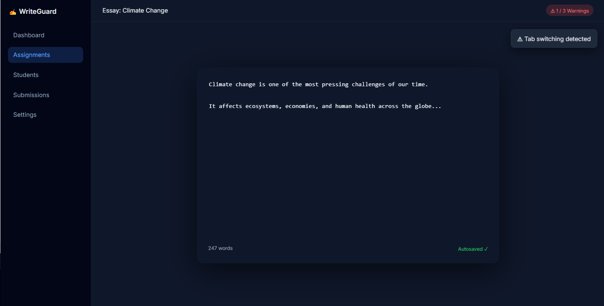

# ✍️ Distraction-Free Writing Platform

A modern SaaS platform designed for teachers to create a **controlled, distraction-restricted writing environment** for students.

> Built to encourage authentic writing in the AI era — not by surveillance, but by smart constraints.

---

## 📸 Product Preview

> A full-featured writing environment with sidebar navigation, real-time monitoring, and distraction control.

---

## 🚀 Overview

This platform provides a **structured writing environment** where students can focus while the system quietly enforces rules:

- No tab switching  
- No exiting fullscreen  

Violations are **tracked, logged, and enforced automatically**.

---

## 🧩 Key Features

### 🧑‍🏫 Teacher Dashboard
- Create assignments with prompts  
- Configure warning limits  
- Distribute via unique URL  
- View submissions in dashboard  
- Export:
  - CSV (metadata)
  - ZIP (.txt responses)

---

### 🧑‍🎓 Student Writing Experience
- No login required  
- Fullscreen writing interface  
- Live word counter  
- Autosave (every 10–15s)  
- Manual or auto submission  

---

### ⚠️ Violation Detection Engine
The core system monitors:

- Tab switching / window blur  
- Fullscreen exit  
- Paste attempts (blocked instantly)  

**Behavior:**
- Violations are timestamped  
- Warning count accumulates  
- Limit reached → **auto-submit + editor lock**

---

## 🎨 UI Highlights

The interface is designed to feel like a **modern SaaS platform**, not just a text editor:

- 📚 Sidebar navigation (Assignments, Students, Submissions)  
- ✨ Clean, distraction-free editor  
- ⚡ Real-time warning indicators  
- 💾 Autosave feedback  
- 🌙 Dark mode professional design  

---

## 🏗️ Tech Stack

- **Frontend:** Vue + Custom Editor  
- **Backend:** Node.js (Express)  
- **Database:** PostgreSQL  
- **Infrastructure:** AWS (S3, EC2)  

---

## 📦 Data Model

Each submission stores:

- Teacher ID  
- Assignment ID  
- Student ID  
- Response text  
- Word count  
- Start + submission timestamps  
- Submission type (manual / auto)  
- Violation logs (type + timestamp)

---

## ⚠️ Browser Limitations

This system is designed to **reduce misuse, not eliminate it completely**:

- Fullscreen cannot be permanently enforced  
- Advanced users may bypass restrictions  
- OS-level actions may not always trigger events  

> In practice: highly effective in real classroom environments.

---

## 🛠️ Development Approach

This platform is built on top of my previous work:

- In-browser editor architecture  
- Local-first state management  
- Real-time input handling  

This allows:
- Faster development  
- Higher reliability  
- Reduced technical risk  

---

## 📅 MVP Scope

- Writing environment  
- Violation detection  
- Dashboard + export  
- Deployment  

---

## 🔮 Future Enhancements

- SSO (Google Classroom)  
- Advanced analytics  
- AI-assisted signals  
- Classroom session monitoring  

---

## 💡 Philosophy

> Make writing simple.  
> Make distractions difficult.  
> Keep everything else invisible.
